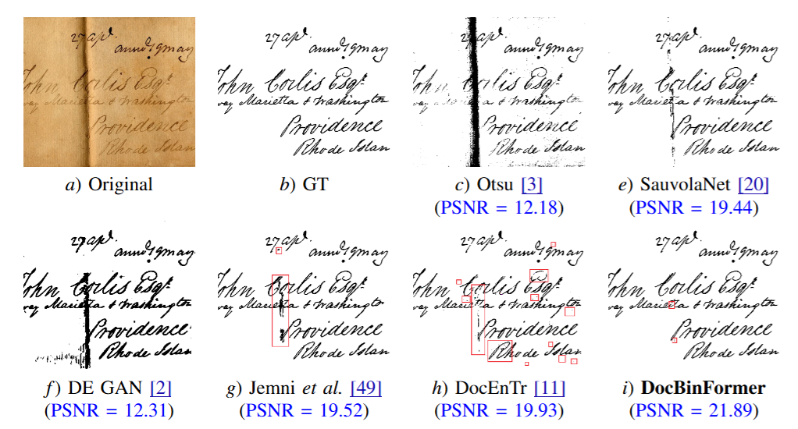

# 🥇DocBinFormer: A Two-Level Transformer Network for Effective Document Image Binarization
The official PyTorch code for the project [DocBinFormer: A Two-Level Transformer Network for Effective Document Image Binarization](https://arxiv.org/pdf/2312.03568).

## Description
We present DocBinFormer, a novel two-level vision transformer (TL-ViT) architecture for document image binarization. The proposed encoder-decoder model employs a two-level transformer encoder to capture both global and local features from input images, enabling effective binarization of system-generated and handwritten document images.

   
<!--    -->

   

